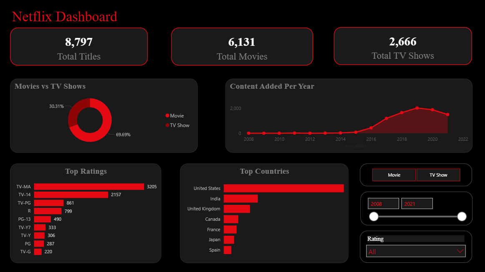
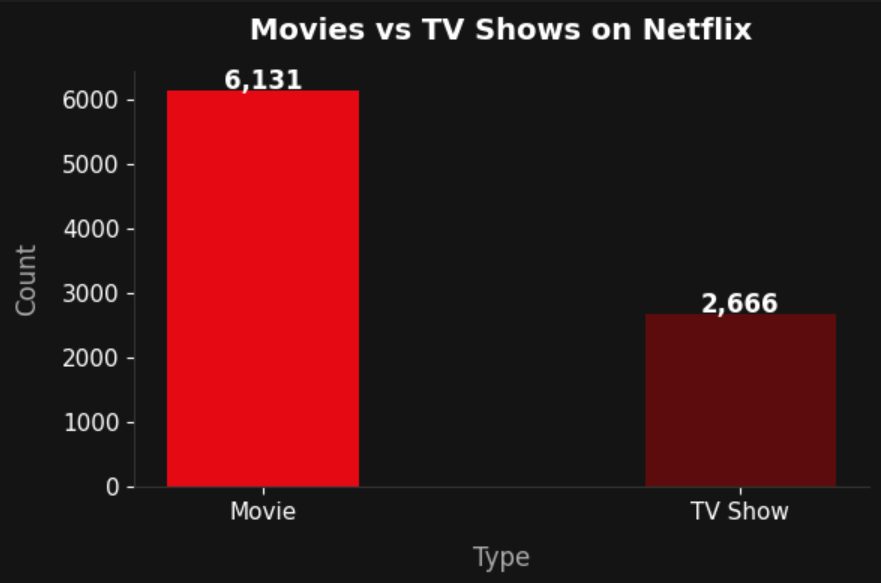
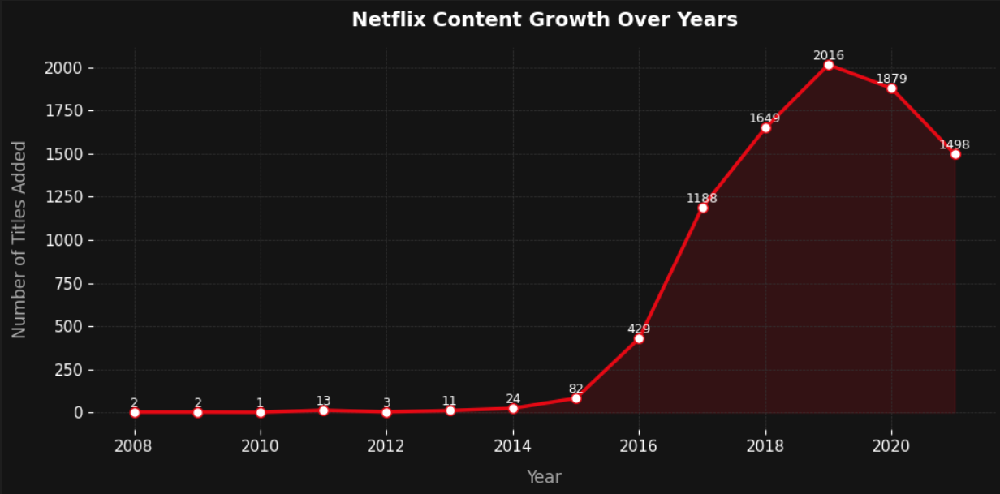
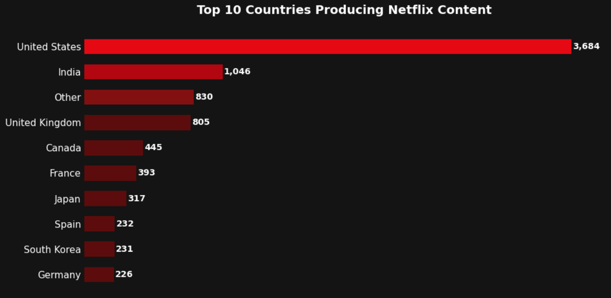
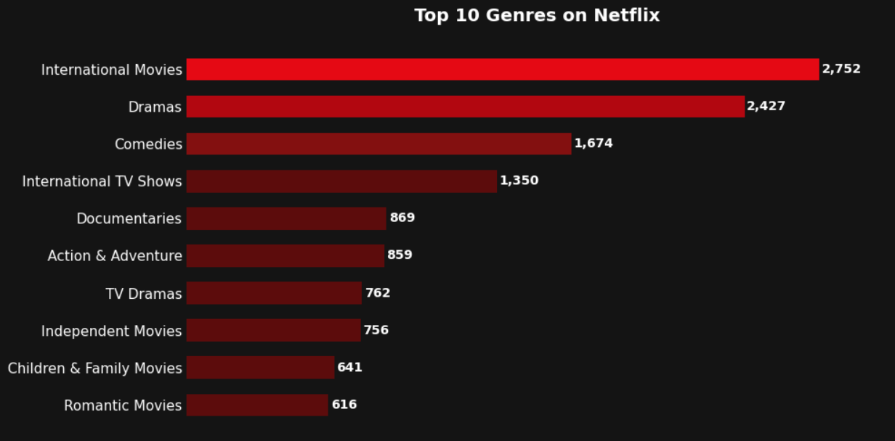
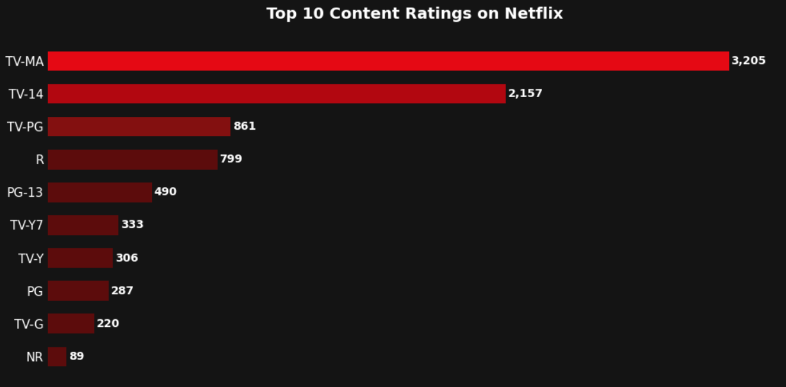
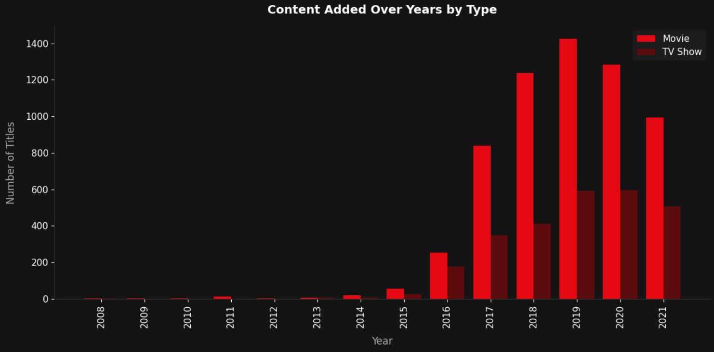
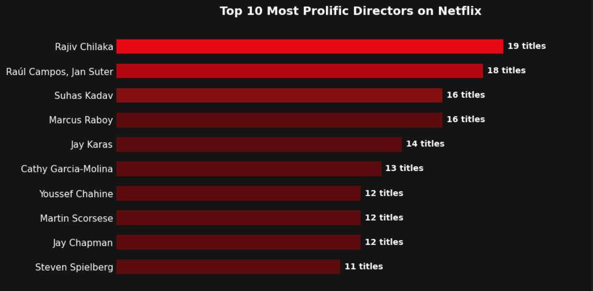

# Netflix Content Analysis

Exploratory data analysis of Netflix's content catalogue, including data cleaning, genre/country breakdowns, and a Power BI dashboard.

---

## Project Structure

| File | Description |
|---|---|
| `raw_netflix.csv` | Original dataset (8,807 rows, 12 columns) — unprocessed Netflix titles |
| `cleaned_netflix.csv` | Cleaned dataset (8,797 rows, 13 columns) — ready for analysis |
| `netflix_country.csv` | Exploded country table — one row per show-country pair |
| `netflix_genres.csv` | Exploded genre table — one row per show-genre pair |
| `analysis.ipynb` | Jupyter notebook covering cleaning steps and visualisations |
| `Netflix_Dashboard.pbix` | Power BI dashboard for interactive exploration |

---

## Dataset

**Source:** Netflix Titles dataset (publicly available on Kaggle)

**Raw columns:** `show_id`, `type`, `title`, `director`, `cast`, `country`, `date_added`, `release_year`, `rating`, `duration`, `listed_in`, `description`

**Added during cleaning:** `year_added` (extracted from `date_added`)

---

## Data Cleaning (`analysis.ipynb`)

The notebook performs the following steps on `raw_netflix.csv`:

- **Missing values** — filled `director`, `cast`, and `country` with placeholder values; imputed missing `duration` by content type (`'90 min'` for Movies, `'1 Season'` for TV Shows); filled missing `rating` as `'NR'`
- **Dropped rows** — removed records where `date_added` was null (10 rows removed)
- **Date parsing** — stripped whitespace and converted `date_added` to datetime; extracted `year_added`
- **Rating fixes** — corrected misplaced duration values (`'74 min'`, `'84 min'`, `'66 min'`) in the rating column to `'NR'`; standardised `'Not Rated'` and `'UR'` → `'NR'`
- **Text cleanup** — stripped leading/trailing whitespace from all text columns; removed embedded newlines from `title`, `description`, `cast`, `director`, `country`, `listed_in`, `duration`, `rating`
- **Deduplication** — dropped exact duplicate rows
- **Column names** — standardised to lowercase with underscores

---

## Derived Tables

Because `country` and `listed_in` (genres) can contain multiple comma-separated values per title, two normalised tables were created by exploding these columns:

- **`netflix_country.csv`** — `show_id` + one `country` per row
- **`netflix_genres.csv`** — `show_id` + one `genre` per row

These are used in the Power BI dashboard for accurate country and genre counts.

---

## Visualisations

The notebook generates matplotlib charts styled with a Netflix dark theme (`#141414` background, `#E50914` red palette). Charts cover content type splits, top genres, content additions over time, and rating distributions.

The **`Netflix_Dashboard.pbix`** file provides an interactive Power BI dashboard built on the cleaned and derived tables.

> **To open the dashboard:** Power BI Desktop is required (free download from Microsoft).

---

## Requirements

```
pandas
matplotlib
jupyter
```

Install with:

```bash
pip install pandas matplotlib jupyter
```

---

## Usage

1. Open `analysis.ipynb` in Jupyter and run all cells to reproduce the cleaning steps and charts.
2. The cleaned outputs (`cleaned_netflix.csv`, `netflix_country.csv`, `netflix_genres.csv`) are already included.
3. Open `Netflix_Dashboard.pbix` in Power BI Desktop for the interactive dashboard.

## Dashboard Preview


## Charts













